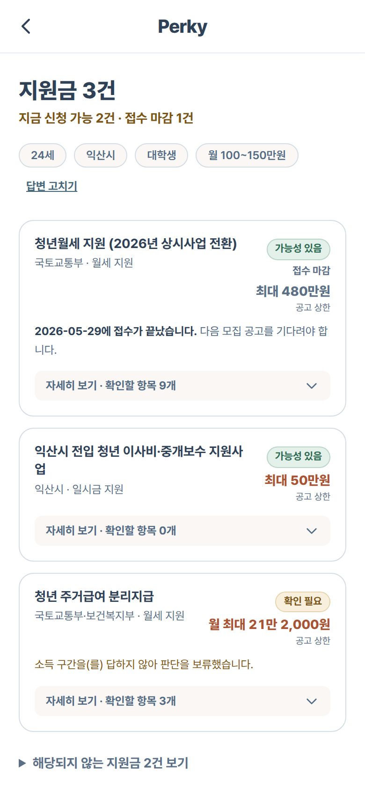

<div align="center">

# Perky (퍼키)

### 청년 주거 지원금, 받을 수 있는지 30초 만에

질문 4개로 **해당될 수 있는 지원금**을 찾고, 계약 조건을 넣으면 **실제로 내 통장에서 나가는 돈**까지 계산합니다.

[](https://wonvengers.vercel.app)

*모바일 화면 기준으로 만들었습니다. 폰으로 열어보시는 걸 권합니다.*


**팀 Wonvengers** · 원광대학교 · 멋쟁이사자처럼 Campus AX-Ton

</div>

<div align="center">
  
  
  
  
</div>

<div align="center">
<sub>랜딩 → 질문 4개 → 해당될 수 있는 지원금 → 최종 예상 주거비 (390×844 실제 화면)</sub>
</div>

---

## 문제

청년 주거 지원금은 **이미 존재합니다.** 못 받는 이유는 돈이 없어서가 아닙니다.

- 어디에 뭐가 있는지 모른다 — 국토부, 도, 시가 따로 공고를 낸다
- 내가 대상인지 모른다 — 나이·지역·소득·학적이 정책마다 다르게 얽혀 있다
- 받아도 얼마가 남는지 모른다 — 월세 상한, 관리비, 지급 개월 수가 제각각이다

## 해결

Perky는 이 셋을 **두 단계로 쪼갭니다.**


**1층만 완성되어도 제품으로 성립합니다.** 모르는 항목은 추측하지 않고 `확인 필요` 태그를 붙입니다 — 틀린 확신보다 정직한 모름이 낫다는 원칙입니다.

## 화면

경로를 누르면 배포된 화면으로 바로 이동합니다.

| 경로 | 층 | 하는 일 |
|---|---|---|
| [`/`](https://wonvengers.vercel.app) | — | 랜딩 |
| [`/find`](https://wonvengers.vercel.app/find) | 1층 · 발견 | 질문 4개 (나이 · 지역 · 상태 · 소득 구간) |
| [`/find/policies`](https://wonvengers.vercel.app/find/policies) | 1층 · 발견 | 해당될 수 있는 지원금 목록 + 태그 |
| [`/calculate`](https://wonvengers.vercel.app/calculate) | 2층 · 계산 | 계약 조건 입력 (F1) |
| [`/eligibility`](https://wonvengers.vercel.app/eligibility) | 2층 · 계산 | 정책별 자격 판정 질문 (F2) |
| [`/result`](https://wonvengers.vercel.app/result) | 2층 · 계산 | 판정 결과 + 최종 예상 주거비 (F3, F4) |

## 실행

```bash
cd apps/web
npm install
npm run dev      # http://localhost:3000
npm test         # vitest 전체 (224 tests)
npm run test:lib # 판정·계산 로직만 (158) — 몇 초
npm run test:ui  # 화면 테스트 (66) — jsdom
npm run build    # 정적 빌드 (output: "export")
```

`npm run fetch:youth` 는 화면과 무관한 **내부 발굴 도구**입니다. 온통청년 API 로 정책 후보 목록
([docs/기획/온통청년-주거후보.md](docs/기획/온통청년-주거후보.md))을 만들고 콘솔에 대조 보고를 찍습니다.
빌드·배포에는 쓰이지 않고, 앱 화면에도 이 API 값이 나가지 않습니다 —
자세한 배경은 [docs/온통청년-API-연동.md](docs/온통청년-API-연동.md) 에 있습니다.

## 구조

| 경로 | 내용 |
|---|---|
| `apps/web/` | Next.js 앱 — **배포 대상** |
| `docs/기획` · `docs/디자인` · `docs/발표` · `docs/마케팅` | PRD · 체크리스트 · 검증기록 · 디자인 · 발표 자료 |
| `docs/온통청년-API-연동.md` | 내부 발굴 도구 문서 (화면에 나가지 않는 API) |
| `docs/이미지/` | README 스크린샷 |

> [!IMPORTANT]
> 배포 시 **Root Directory 를 `apps/web` 으로** 지정해야 합니다. 레포 루트에는 앱이 없습니다.

기획 배경과 요구사항은 [docs/기획/PRD.md](docs/기획/PRD.md) 에 있습니다.

## 데이터

<details>
<summary><b>정책 데이터를 다룰 때 지켜야 할 규칙</b> (펼치기)</summary>

<br/>

정책 데이터는 `apps/web/data/policies.json` **한 곳**에만 둡니다.
발표용 스크린샷은 `apps/web/scripts/capture-screens.mjs` 가 가상 조건을 직접 주입해 찍습니다 —
실제 매물이 아니므로 캡처를 실제 사례처럼 쓰지 마세요.

`apps/web/data/` 전체는 다음과 같습니다.

| 파일 | 쓰는 곳 |
|---|---|
| `policies.json` | 정책 원본 — 1층 판정 · 2층 계산 모두 |
| `income-brackets.json` | 1층 소득 구간 선택지 5개 (`월 100만원 이하` … `월 250만원 초과`) |
| `income-thresholds.json` | 2층 중위소득 기준액 — 실제 금액으로 판정할 때 |
| `loan-products.json` | 결과 화면의 대출 상품 안내 |

| 용도 | 사용하는 필드 |
|---|---|
| 1층 · 발견 | 각 정책의 `discovery` 블록 — `ageMin` / `ageMax` / `regions` / `statuses` / `incomeBracketMin` / `incomeBracketMax` |
| 2층 · 계산 | `regionScope`, `requiredInputs`, `benefitType`, `monthlyCap` 등 |

> [!NOTE]
> `youthPolicyNo` 는 **화면에서 쓰지 않지만 지우면 안 되는 필드**입니다. 발굴 스크립트가
> "이 후보는 이미 앱에 있다"를 가려내는 열쇠라서, 형식이 깨지면 같은 정책이 후보 목록에
> 다시 올라옵니다. 테스트 2개가 이 필드를 검사합니다 (`lib/__tests__/policies.test.ts`).

`discovery.statuses` 와 `discovery.incomeBracketMax` 가 `null` 인 이유는 둘 중 하나입니다.

1. **공식 공고 확인 전**
2. 확인은 했지만 **1층 질문 4개로는 판정할 수 없음** — 본인이 아닌 원가구 소득으로 심사하는 정책(청년 주거급여 분리지급)

> [!WARNING]
> `null` 값을 추정해서 채우지 마세요. `null` 이면 1층이 `확인 필요` 태그를 붙입니다 (PRD F0-5).
> 임의로 숫자를 넣으면 자격이 없는 사람에게 `가능성 있음`이 표시됩니다.

**`incomeBracketMin` 만 예외로 `null` 이 '하한 조건 없음'을 뜻합니다.** 소득 상한은 모든 청년 정책에 있지만
하한은 익산형 청년월세(중위 60% *초과* ~ 130% 이하) 하나뿐입니다 — `null` 을 '모름'으로 읽으면 나머지 정책
전부가 이유 없이 `확인 필요` 가 됩니다.

`incomeBracketMin`/`Max` 를 채울 때는 정책 소득 기준(1인 가구 기준)이 **걸쳐 있는 구간까지** 통과시킵니다.
중위 60% = 월 1,538,543원은 3번 구간(150~200만원)에 걸쳐 있으므로 '60% 이하'면 `Max: 3`, '60% 초과'면 `Min: 3` 입니다.
경계 구간은 2층에서 실제 금액으로 판정합니다 — 1층에서 잘라 버리면 자격이 되는 사람에게 정책이 아예 보이지 않습니다.

검증 근거는 [docs/기획/2026-08-23-정책데이터-검증기록.md](docs/기획/2026-08-23-정책데이터-검증기록.md) 에 있습니다.

</details>

## 출처와 검수

정책 데이터는 팀이 공고를 손으로 옮긴 값입니다. 그래서 **숫자마다 원문으로 가는 길과 대조 날짜를
화면에 그대로 드러냅니다** — 어느 쪽을 믿을지 사용자가 판단할 수 있어야 합니다.

1층 지원금 카드를 펼치면 `이 정보의 출처` 블록이 있고, 여기서 갈립니다.

| `verifiedAt` | 화면 표기 |
|---|---|
| 날짜 있음 | `공고 원문 →` 링크 + `팀이 (날짜)에 공고 원문과 대조했습니다.` |
| `null` | `공고 원문 →` 링크 + **`아직 공고 원문과 대조하지 않았습니다. 신청 전에 원문을 직접 확인하세요.`** |

결과 화면의 정책별 상세에도 같은 `공고 원문` 링크가 있습니다.

현재 정책 5건 중 **4건은 2026-08-23 대조 완료**, 1건(`익산형 청년월세 지원사업`)은 대조 전입니다.
근거는 [docs/기획/2026-08-23-정책데이터-검증기록.md](docs/기획/2026-08-23-정책데이터-검증기록.md) 에 있습니다.

> [!CAUTION]
> `notes` 에 "미검증 초안"이 적힌 정책도 교차검수 전으로 취급합니다.
> 발표·배포 전에는 대조가 끝난 정책까지 공고를 다시 확인하세요 — 공고는 갱신됩니다.

## 기여

작업 흐름은 `feature/*` → `develop` → `main` 입니다.

```bash
git checkout develop && git pull
git checkout -b feature/기능이름
# 작업 후
git push -u origin feature/기능이름   # develop 대상으로 PR
```

`develop` 과 `main` 은 보호되어 있어 직접 푸시할 수 없습니다. PR 로만 반영됩니다.
