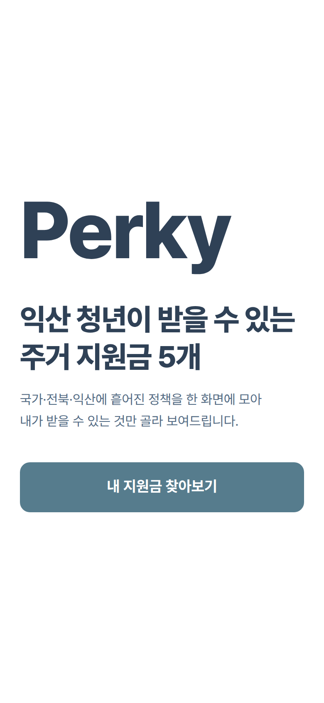
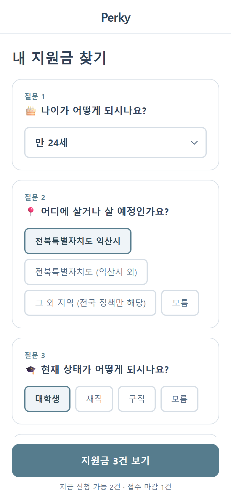
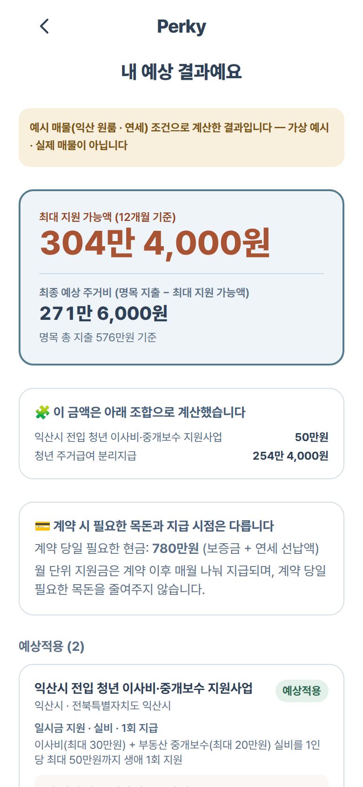
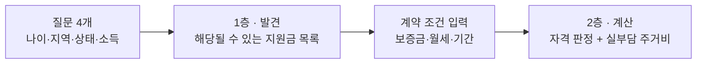

<div align="center">

# Perky (퍼키)

### 청년 주거 지원금, 받을 수 있는지 30초 만에

질문 4개로 **해당될 수 있는 지원금**을 찾고, 계약 조건을 넣으면 **실제로 내 통장에서 나가는 돈**까지 계산합니다.

[](https://wonvengers.vercel.app)

*모바일 화면 기준으로 만들었습니다. 폰으로 열어보시는 걸 권합니다.*


**팀 Wonvengers** · 원광대학교 · 멋쟁이사자처럼 Campus AX-Ton

</div>

<!--
  스크린샷 자리 — 캡처가 준비되면 이 주석을 지우고 아래 형태로 넣으면 됩니다.

  <div align="center">
    
    
    
  </div>

  권장: /(랜딩), /find(질문·목록), /result(최종 계산) 세 장
-->

---

## 문제

청년 주거 지원금은 **이미 존재합니다.** 못 받는 이유는 돈이 없어서가 아닙니다.

- 어디에 뭐가 있는지 모른다 — 국토부, 도, 시가 따로 공고를 낸다
- 내가 대상인지 모른다 — 나이·지역·소득·학적이 정책마다 다르게 얽혀 있다
- 받아도 얼마가 남는지 모른다 — 월세 상한, 관리비, 지급 개월 수가 제각각이다

## 해결

Perky는 이 셋을 **두 단계로 쪼갭니다.**



**1층만 완성되어도 제품으로 성립합니다.** 모르는 항목은 추측하지 않고 `확인 필요` 태그를 붙입니다 — 틀린 확신보다 정직한 모름이 낫다는 원칙입니다.

## 화면

경로를 누르면 배포된 화면으로 바로 이동합니다.

| 경로 | 층 | 하는 일 |
|---|---|---|
| [`/`](https://wonvengers.vercel.app) | — | 랜딩 |
| [`/find`](https://wonvengers.vercel.app/find) | 1층 · 발견 | 질문 4개 → 해당될 수 있는 지원금 목록 + 태그 |
| [`/calculate`](https://wonvengers.vercel.app/calculate) | 2층 · 계산 | 계약 조건 입력 (F1) |
| [`/eligibility`](https://wonvengers.vercel.app/eligibility) | 2층 · 계산 | 정책별 자격 판정 질문 (F2) |
| [`/result`](https://wonvengers.vercel.app/result) | 2층 · 계산 | 판정 결과 + 최종 예상 주거비 (F3, F4) |

## 실행

```bash
cd apps/web
npm install
npm run dev      # http://localhost:3000
npm test         # vitest (64 tests)
npm run build    # 정적 빌드 (output: "export")
```

## 구조

| 경로 | 내용 |
|---|---|
| `apps/web/` | Next.js 앱 — **배포 대상** |
| `docs/` | 기획 · 디자인 · 발표 · 마케팅 |

> [!IMPORTANT]
> 배포 시 **Root Directory 를 `apps/web` 으로** 지정해야 합니다. 레포 루트에는 앱이 없습니다.

기획 배경과 요구사항은 [docs/기획/PRD.md](docs/기획/PRD.md) 에 있습니다.

## 데이터

<details>
<summary><b>정책 데이터를 다룰 때 지켜야 할 규칙</b> (펼치기)</summary>

<br/>

정책 데이터는 `apps/web/data/policies.json` **한 곳**에만 둡니다.

| 용도 | 사용하는 필드 |
|---|---|
| 1층 · 발견 | 각 정책의 `discovery` 블록 — `ageMin` / `ageMax` / `regions` / `statuses` / `incomeBracketMax` |
| 2층 · 계산 | `regionScope`, `requiredInputs`, `benefitType`, `monthlyCap` 등 |

`discovery.statuses` 와 `discovery.incomeBracketMax` 가 `null` 인 정책은 **공식 공고 확인 전**이라는 뜻입니다.

> [!WARNING]
> `null` 값을 추정해서 채우지 마세요. `null` 이면 1층이 `확인 필요` 태그를 붙입니다 (PRD F0-5).
> 임의로 숫자를 넣으면 자격이 없는 사람에게 `가능성 있음`이 표시됩니다.

</details>

## 검수 상태

> [!CAUTION]
> `verifiedAt` 이 `null` 이거나 `notes` 에 "미검증 초안"이 적힌 정책은 **팀 교차검수 전**입니다.
> 발표·배포 전에 반드시 공식 공고로 확인해야 합니다.

## 기여

작업 흐름은 `feature/*` → `develop` → `main` 입니다.

```bash
git checkout develop && git pull
git checkout -b feature/기능이름
# 작업 후
git push -u origin feature/기능이름   # develop 대상으로 PR
```

`develop` 과 `main` 은 보호되어 있어 직접 푸시할 수 없습니다. PR 로만 반영됩니다.
